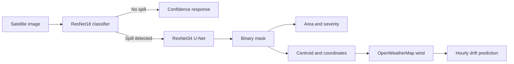

# AI-Powered Oil Spill Detection, Segmentation, and Prediction System

An end-to-end machine learning system for detecting oil spills in satellite imagery, outlining affected areas, estimating severity, and predicting short-term drift from local wind conditions.

## Problem Statement

Oil spills can spread rapidly and threaten marine ecosystems, coastal communities, fisheries, and shipping operations. Manual image review is slow and difficult to scale, while early response depends on both reliable detection and useful location and movement estimates.

This project combines image classification, pixel-level segmentation, geospatial analysis, and weather data into one workflow for faster initial assessment and incident reporting.

## Architecture Overview

The inference pipeline uses two stages:

1. **Classification:** A grayscale ImageNet-pretrained ResNet18 determines whether the uploaded image contains an oil spill and produces a confidence score.
2. **Segmentation:** When a spill is detected, a U-Net with a ResNet34 encoder predicts a binary spill mask. The mask is used to estimate area, severity, and (when geographic bounds are supplied) the spill centroid.
3. **Drift prediction:** The centroid is combined with current wind data from OpenWeatherMap. A 3% wind-drift rule of thumb produces predicted positions at hourly intervals.



## Tech Stack

- **Python** and **PyTorch** for model training and inference
- **Torchvision** for the ResNet18 classifier
- **Segmentation Models PyTorch** for the U-Net segmentation model
- **OpenCV** and **NumPy** for image processing and mask encoding
- **FastAPI** and **Uvicorn** for the inference API
- **Streamlit**, **Folium**, and **streamlit-folium** for the dashboard
- **Requests** for API and weather-service calls
- **Matplotlib** for planned analysis and visualization workflows

## Folder Structure

```text
ml-service/
├── app.py                              # FastAPI inference service
├── dashboard.py                        # Streamlit dashboard
├── requirements.txt                    # Python dependencies
├── test_predict.py                     # Local API prediction client
├── classifier/
│   ├── model.py                        # ResNet18 classifier factory
│   ├── train_classifier.py             # Classifier training script
│   └── oil_spill_classifier.pth        # Generated classifier checkpoint
├── segmentation/
│   ├── model.py                        # U-Net model factory
│   ├── train_segmentation.py           # Segmentation training script
│   └── oil_spill_segmentation.pth      # Generated segmentation checkpoint
├── utils/
│   ├── preprocessing.py                 # Image-mask loading and tensors
│   ├── geo_utils.py                     # Coordinates and drift prediction
│   ├── weather_utils.py                 # OpenWeatherMap integration
│   └── severity_utils.py                # Area, severity, and reports
└── data/
		├── Class_0/                         # Non-spill classification images
		├── Class_1/                         # Spill classification images
		├── images/                          # Segmentation images
		└── masks/                           # Matching segmentation masks
```

Model checkpoint files are generated after training and should not be expected in a fresh checkout.

## Setup

From the `ml-service` directory, create and activate a virtual environment:

### Windows PowerShell

```powershell
python -m venv venv
.\venv\Scripts\Activate.ps1
python -m pip install --upgrade pip
pip install -r requirements.txt
```

### macOS or Linux

```bash
python3 -m venv venv
source venv/bin/activate
python -m pip install --upgrade pip
pip install -r requirements.txt
```

Set an OpenWeatherMap API key to enable wind-based drift predictions:

```powershell
$env:OPENWEATHER_API_KEY = "your-api-key"
```

```bash
export OPENWEATHER_API_KEY="your-api-key"
```

Place the trained checkpoints at:

- `classifier/oil_spill_classifier.pth`
- `segmentation/oil_spill_segmentation.pth`

To train them from the local dataset:

```bash
python classifier/train_classifier.py
python segmentation/train_segmentation.py
```

The segmentation script expects matching image and mask filenames in `data/images/` and `data/masks/`.

## Run the API

Start the FastAPI service from the project directory:

```bash
uvicorn app:app --reload --host 0.0.0.0 --port 8000
```

The API is available at `http://localhost:8000`. Interactive documentation is available at `http://localhost:8000/docs`.

## Run the Dashboard

With the API running in one terminal, start the Streamlit dashboard in another:

```bash
streamlit run dashboard.py
```

The dashboard uploads an image to `/predict`, displays the original and segmented images, and shows the optional spill location and predicted drift path on a map.

## Dataset Sources

- **CSIRO Sentinel-1 SAR dataset:** [CSIRO Data Access Portal](https://data.csiro.au/) and the [Sentinel-1 mission overview](https://sentinel.esa.int/web/sentinel/missions/sentinel-1). Search the CSIRO portal for the relevant Sentinel-1 SAR oil-spill collection and follow its licensing and attribution requirements.
- **Segmentation dataset:** [Segmentation dataset placeholder](https://example.com/oil-spill-segmentation-dataset). Replace this placeholder with the selected image-mask dataset before production use.

Classification data should be arranged into `Class_0` and `Class_1`. Segmentation data should contain one image and one same-named mask for every training sample.

## API Usage

Send a multipart request with an image and optional geographic bounds:

```bash
curl -X POST "http://localhost:8000/predict" \
	-F "file=@data/Class_1/class_1_00001.jpg" \
	-F "top_left_lat=19.5" \
	-F "top_left_lon=72.5" \
	-F "bottom_right_lat=19.0" \
	-F "bottom_right_lon=73.0"
```

A detected spill response includes:

```json
{
	"spill_detected": true,
	"confidence": 0.94,
	"area_km2": 2.31,
	"severity": "medium",
	"spill_location": {"lat": 19.24, "lon": 72.78},
	"drift_prediction": [[19.24, 72.78], [19.25, 72.80]],
	"mask_image": "<base64-encoded PNG>"
}
```

When the classifier confidence is below 0.5, the API returns an early response containing `spill_detected` and `confidence`.

## Future Work

- Integrate ocean current and wave data into drift prediction
- Replace the rule-of-thumb drift model with ML-based spread prediction
- Add marine risk analysis for coastlines, fisheries, ports, and protected areas
- Generate cleanup recommendations based on spill severity, location, and environmental risk
